# Bestiary

Auto-generated gallery of all **28** creature templates — built offline by the procedural pipeline and rendered headlessly (`pgap.render`, no engine). Regenerate with `python -m pgap.catalog`; do not hand-edit.

| Preview | Creature | Bones · Tris · Height | Coat · Eyes | Modules |
|:---:|---|---|---|---|
| 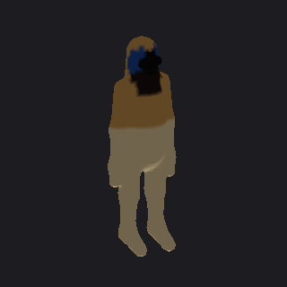 | **biped** | 23 · 5824 · 180 cm | tan · blue | spine, neck, head, eyes, jaws, arm, leg |
| 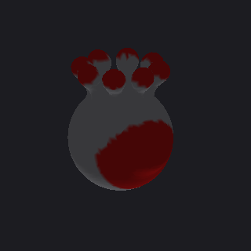 | **beholder** | 26 · 10040 · 80 cm | stone · red | orb, eye, eyestalk |
| 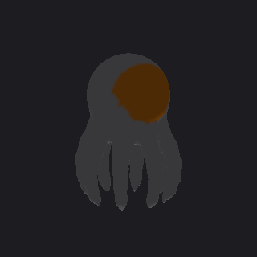 | **kraken** | 50 · 9732 · 70 cm | stone · amber | orb, eye, tentacle |
| 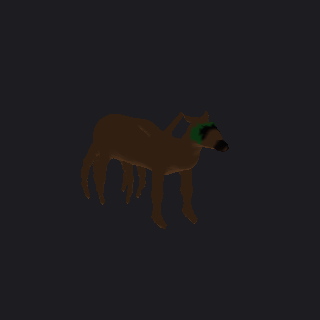 | **octopus_dragon** | 71 · 5836 · 130 cm | chocolate · green | body, neck, head, horn, eyes, jaws, wing, leg, tentacle |
| 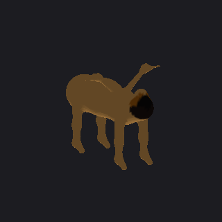 | **sphinx** | 35 · 9868 · 120 cm | golden · amber | body, neck, head, eyes, jaws, wing, leg |
| 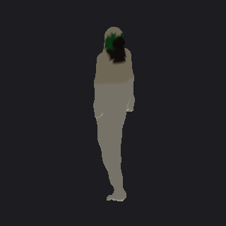 | **merfolk** | 27 · 3928 · 175 cm | cream · green | spine, neck, head, eyes, jaws, arm, tail, fin |
| 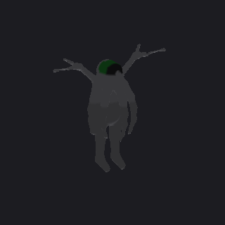 | **cthulhu** | 71 · 7492 · 240 cm | stone · green | spine, neck, head, eyes, jaws, arm, leg, wing, tentacle |
| 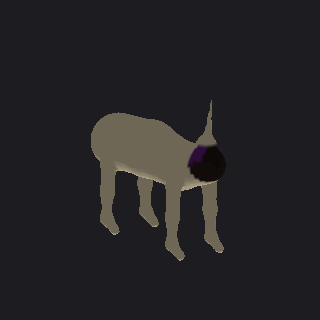 | **unicorn** | 24 · 9500 · 160 cm | cream · violet | body, neck, head, eyes, jaws, horn, leg |
| 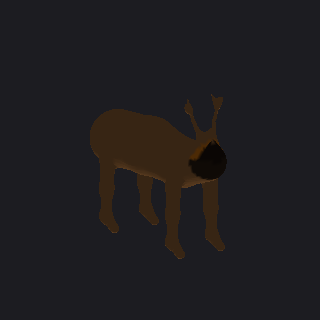 | **stag** | 29 · 9932 · 150 cm | brown · amber | body, neck, head, eyes, jaws, horn, leg |
| 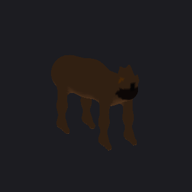 | **boar** | 29 · 8656 · 90 cm | chocolate · amber | body, neck, head, eyes, jaws, tusk, ear, leg |
| 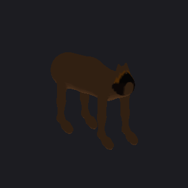 | **horse** | 32 · 10484 · 160 cm | chocolate · amber | body, neck, head, eyes, jaws, ear, mane, leg, hoof |
| 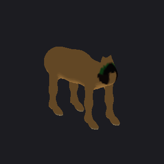 | **feline** | 40 · 9616 · 100 cm | golden · green | body, neck, head, eyes, jaws, ear, mane, leg, claw |
| 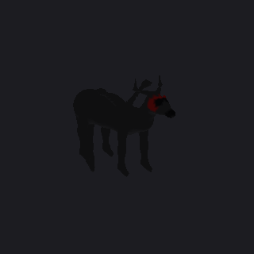 | **dragon** | 51 · 7256 · 140 cm | black · red | body, neck, head, horn, eyes, jaws, wing, leg, tail, spikes |
| 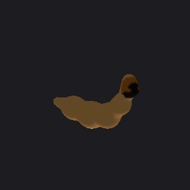 | **serpent** | 12 · 3884 · 70 cm | golden · amber | serpent_body, head, eyes, jaws |
| 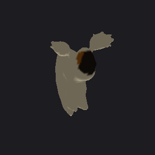 | **avian** | 33 · 6636 · 45 cm | cream · amber | avian_torso, neck, head, eyes, beak, wing, leg, tail |
| 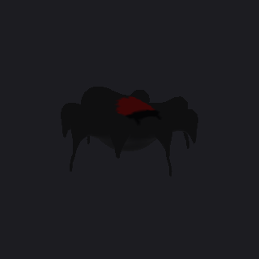 | **arachnid** | 30 · 5894 · 35 cm | black · red | arachnid_body, spider_leg, eyes |
| 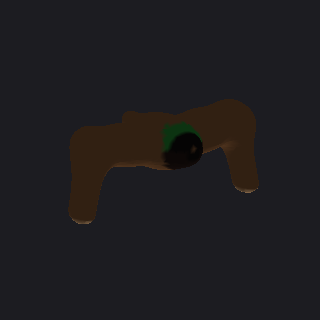 | **hexapod** | 27 · 5280 · 30 cm | chocolate · green | hexapod_body, eyes, jaws, insect_leg |
| 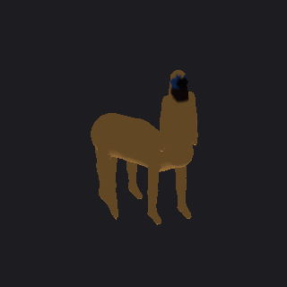 | **centaur** | 37 · 8604 · 210 cm | tan · blue | body, centaur_torso, neck, head, eyes, jaws, arm, leg, tail |
| 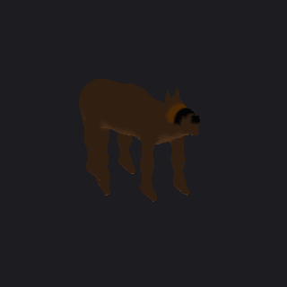 | **wolf** | 31 · 7812 · 90 cm | chocolate · amber | body, neck, head, eyes, ear, leg, tail |
| 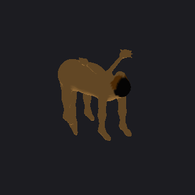 | **griffin** | 46 · 8948 · 130 cm | golden · amber | body, neck, head, eyes, beak, wing, leg, claw, tail |
| 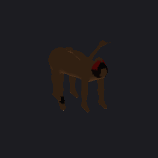 | **manticore** | 45 · 10252 · 140 cm | chocolate · red | body, neck, head, eyes, jaws, mane, wing, leg, tail, stinger |
| 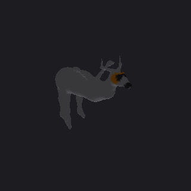 | **wyvern** | 40 · 6532 · 150 cm | stone · amber | body, neck, head, horn, eyes, jaws, wing, leg, tail |
| 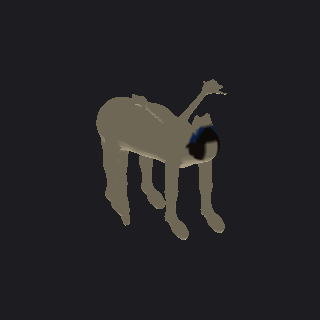 | **pegasus** | 49 · 10392 · 160 cm | cream · blue | body, neck, head, eyes, jaws, ear, mane, wing, leg, hoof, tail |
| 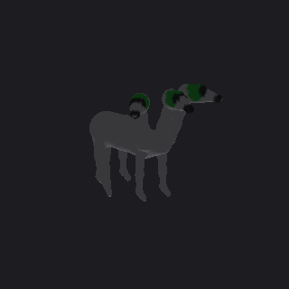 | **hydra** | 53 · 9576 · 160 cm | stone · green | hydra_body, hydra_neck, head, eyes, jaws, leg, tail |
| 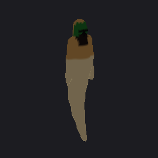 | **naga** | 22 · 4232 · 200 cm | golden · green | spine, neck, head, eyes, jaws, arm, tail |
| 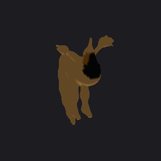 | **phoenix** | 34 · 5840 · 90 cm | golden · amber | avian_torso, neck, head, eyes, beak, horn, wing, leg, tail |
| 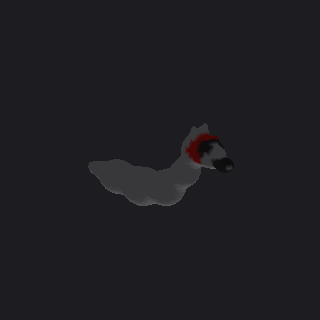 | **basilisk** | 19 · 3468 · 75 cm | stone · red | serpent_body, head, horn, eyes, jaws |
| 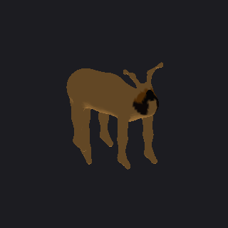 | **chimera** | 37 · 10088 · 140 cm | golden · amber | body, neck, head, eyes, jaws, horn, mane, leg, tail |
